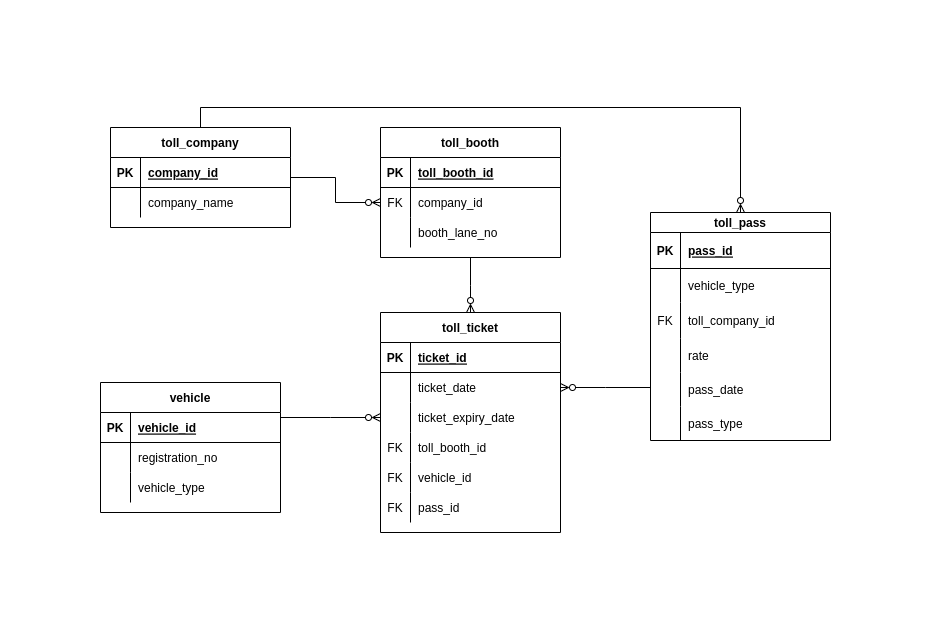
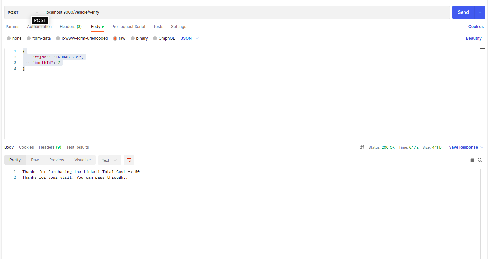
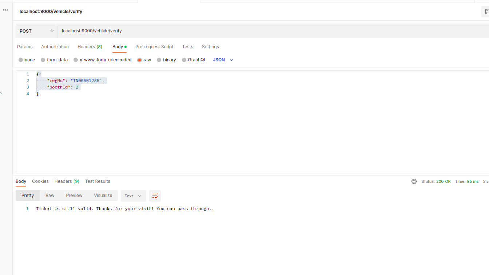

# Toll Management System

Backend service for unified toll management system with docker deployment. Plug n play.

### Requirements

- jdk 1.8
- IntelliJ with scala plugin installed
- Scala 2.12.10 & SBT 1.3.4
- postgres installed
- Postman
- docker
- docker-compose

### DB Schema



### Table queries

```roomsql
CREATE TABLE toll_company(
   company_id INT PRIMARY KEY     NOT NULL,
   company_name           TEXT    NOT NULL
);
```

```roomsql
CREATE TABLE toll_booth(
   toll_booth_id INT PRIMARY KEY     NOT NULL,
   company_id INT references toll_company,
   booth_lane_no  INT NOT NULL
);
```

```roomsql
CREATE TABLE toll_pass(
   pass_id INT PRIMARY KEY     NOT NULL,
   vehicle_type VARCHAR(3) NOT NULL,
   toll_booth_id INT references toll_booth,
   rate INT,
   pass_date DATE,
   pass_type  VARCHAR(7) NOT NULL
);
```

```roomsql
CREATE TABLE public.vehicle(
      vehicle_id serial PRIMARY KEY,
      registration_no VARCHAR(10) NOT NULL,
      vehicle_type VARCHAR(3)
);
```

```roomsql
CREATE TABLE public.toll_ticket(
   ticket_id serial PRIMARY KEY,
   ticket_date DATE,
   ticket_expiry_date DATE,
   toll_booth_id INT references toll_booth,
   vehicle_id INT references vehicle,
   pass_id  INT references toll_pass
);
```

### APIs avaialable 

#### fetching the db contents

```sh
GET     /tolls
GET     /booths
GET     /passes
```

- above apis to get the db contents

> alternatively we can use curl commands

```sh
curl localhost:9000/tolls
```
will fetch the following,
```output
ubuntu@ubuntu-HP-Laptop-15-bs1xx:~$ curl localhost:9000/tolls
[{"id":1,"companyName":"TNP"},{"id":2,"companyName":"TNG"}]
```

#### Adding Entries in Tables

1. `POST    /toll/add`

- put the following json in the body

```json
{
  "id": 1,
  "name": "TNC"
}
```

2. `POST    /booth/add`

- put the following json in the body

```json
{
  "id": 1,
  "tollId": 1,
  "boothNo": 2
}
```

3. `POST    /pass/add`

- put the following json in the body

```json
{
  "id": 1,
  "vehicleType": "2W",
  "tollId": 1,
  "rate": 30,
  "passType": "SINGLE"
}
```

> using curl alternative

```
curl -X POST localhost:9000/toll/add
-H 'Content-Type: application/json'
-d '{"id": 1,"name": "TNC"}'
```

### Getting/Checking the tickets

Use the following API

POST /vehicle/verify

```json
{
    "regNo": "TN00AB1235",
    "boothId": 2
}
```

alternatively, you can use curl also.

So, If the ticket is not found, You have to enter the input in the deployed screen.

## Output




```shell
Welcome new User! 
Select the Type of Vehicle: 
1. 2 Wheeler
2. 4 Wheeler
2
Select the Pass Type: 
1. Single
2. Return
3. Weekly
3
```

### Deploying

- Several methods are available thanks to the sbt-native-packager, the simplest being sbt dist, which will drop a self-contained zipped Java application in the target/universal folder
   - The zip file can be extracted onto any system running Java 8 JRE and started using the appropriate script in the bin directory. On Windows, should the batch file give an error, there is an alternative start.bat in the root folder.
   - By default, the config from conf/application.conf will be used, so make sure the settings for deploy are correct
   - Alternatively, new config files for other environments can be added to the conf folder, and used by adding -Dconfig.resource=conf/prod.conf to the command line when executing the packaged app
- Another option is to use the `sbt docker:publishLocal` option if you have Docker installed. This will give you a container image to push to your Docker Hub Repo or Amazon ECR account
   - Using this option, the docker-compose.yml file is also useful for testing.
   - The ENTRYPOINT for the Dockerfile is the Java application, so parameters (such as conf override) can be passed in as CMDs.

#### Steps to deploy using docker-compose

- go to the project folder, do the following

```shell
sbt docker:publishLocal 
```
- Once the images are created. Check for the application.conf for the postgres server name

> change it into `db` if running via docker-compose else `localhost`

- Now, use the following command to start

```shell
docker-compose up
```

- Both DB and App services will be started. Now we can use the rest API. For interaction, docker-compose by default doesn't allow interactive shell

So, Do the following,

```shell
docker ps
```

- copy the container ID of the toll management system and open a new terminal

```shell
docker attach <CONTAINER_ID>
```

Now, the terminal will show any output of App. You can enter the inputs here if Prompted.

```shell
> sample
ubuntu@ubuntu-HP-Laptop-15-bs1xx:~/IdeaProjects/toll-management-system/toll-management-system$ docker attach 31348cf203e0
Welcome new User! 
Select the Type of Vehicle: 
1. 2 Wheeler
2. 4 Wheeler
1
Select the Pass Type: 
1. Single
2. Return
3. Weekly
1
```

- docker-compose log as follows

```shell
db_1   | PostgreSQL init process complete; ready for start up.
db_1   | 
db_1   | LOG:  database system was shut down at 2022-10-27 17:57:37 UTC
db_1   | LOG:  MultiXact member wraparound protections are now enabled
db_1   | LOG:  database system is ready to accept connections
db_1   | LOG:  autovacuum launcher started
app_1  | 2022-10-27 17:57:40 INFO  play.api.Play  Application started (Prod) (no global state)
app_1  | 2022-10-27 17:57:41 INFO  play.core.server.AkkaHttpServer  Listening for HTTP on /0.0.0.0:9000
app_1  | Welcome new User! 
app_1  | Select the Type of Vehicle: 
app_1  | 1. 2 Wheeler
app_1  | 2. 4 Wheeler
app_1  | 1
app_1  | Select the Pass Type: 
app_1  | 1. Single
app_1  | 2. Return
app_1  | 3. Weekly
app_1  | 1
```


### TODOs and Improvements

- Adding DELETE Apis for removing data from the Tables
- Interactive subscription of toll ticket instead of POST Request
- Adding additional Test cases
- Time based working instead of only Dates, which works as of now.